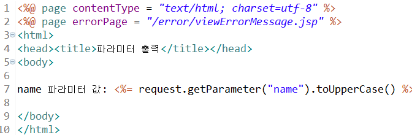
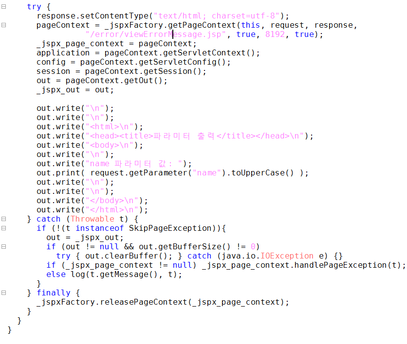

# chap06(JSP 에러 처리)


## 1.try-catch   

---

`readParameterWithTry.jsp`  



`readParameterWithTry_jsp.java`  


```
예외가 발생한다고 예상되는 지점에서 try-catch 처리를 한다.
jsp java 파일을 확인해보면 코드가 그대로 추가된다.
```

<br />
<br />


## 2.Page Directive(errorPage)

---
`readParameter.jsp`   
   
`readParameter_jsp.java`   
   

```
페이지 디렉티브에서 에러페이지를 설정하면   
jsp java 파일에서 pageContext 객체를 선언하는 함수에서     
인수로 에러페이지가 추가 되는것을 확인 할 수 있다.   

에러 발생시    
pageContext 객체는 handlePageException 메소드에 예외 객체를 넘긴다.   
1. 해당 페이지의 PageDirective에 ErrorPage    
2. web.xml에 정의한 errorPage   
3. 위의 둘 중 하나도 해당이 되지 않는다면 ServletException을 throw하여    
    tomcat 내부에서 저장된 페이지를 보여준다.   

```


## 3.exception Object(isErrorPage)

---

`error/viewErrorMessage.jsp`   
   
`error/viewErrorMessage_jsp.java`   
   

``` 
페이지 디렉티브에서 isErrorPage="true" 일때
해당 페이지는 전 페이지의 예외 객체를 받아 
exception 객체를 쓸 수 있다.

java 파일을 보면 exception 객체가 추가 되는 것을 확인 할 수 있다.
```