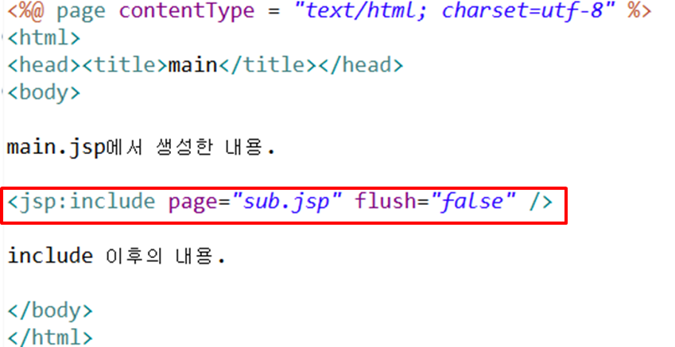
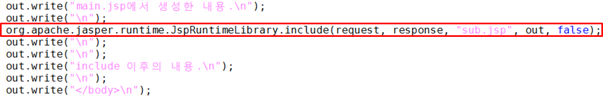
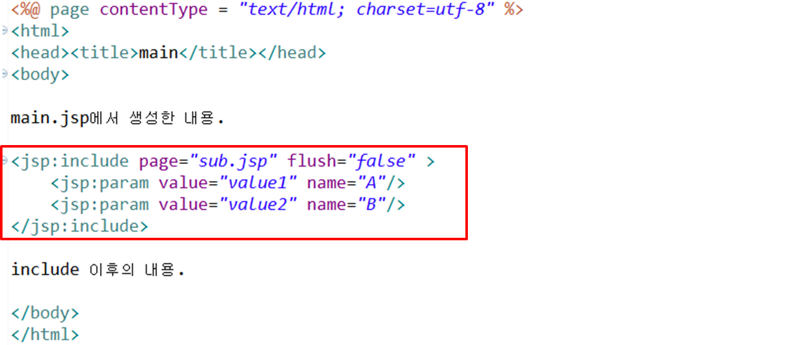
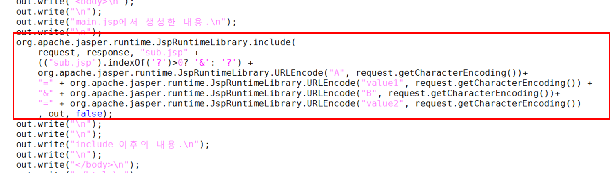
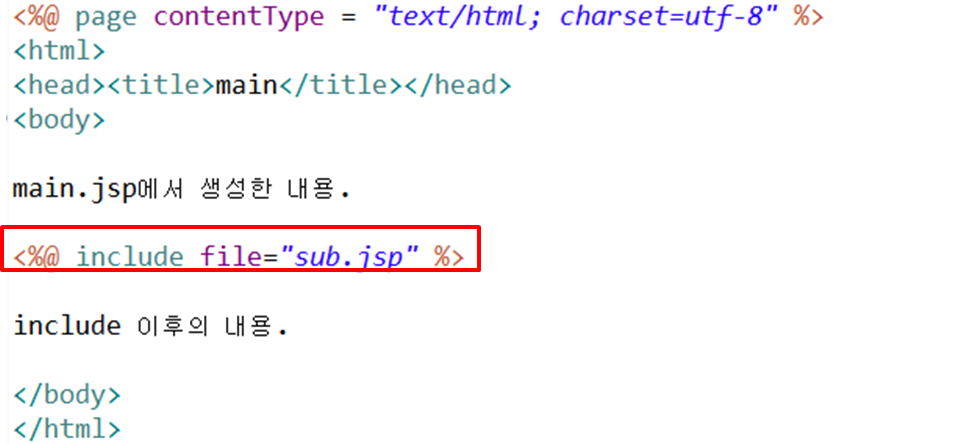
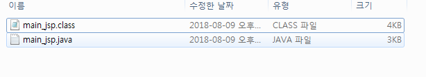
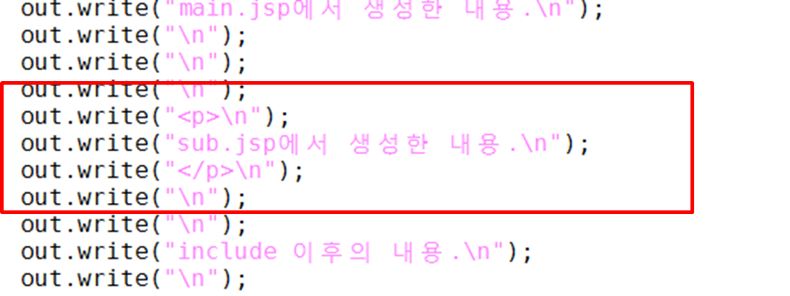
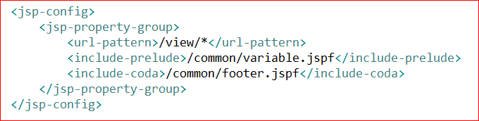

# chap07(include action tag)

---


## 1. include action tag


  

```
java 파일을 확인해보면 

해당 자리에 include 메소드에 request, response, out 객체가       
인수로 넘어가는 것을 알 수 있다. 

```




```
java 파일을 확인해보면

get 방식 형태로 주소뒤에 붙는 것을 알 수 있다.   
따라서 param 액션 태그 대신 query String 으로 붙여도 기능은 같다.   
대신 인코딩 처리를 해준다.   

```


## 2. include directive




```
java 파일을 변환하는 과정에서 처리된다.
따라서 해당 include하는 jsp파일의 java파일은 생성 되지 않는다.
```


```
web.xml파일에서 해당 특정 jsp파일에 대한 
include 디렉티브를 설정 할 수 있다.
```


## 3. include action VS include directive

| 차이 | `<jsp:include page="includeePage"/>` | `<%@ include page="includeePage" %>` |
|-----------|-----------|-----------|
| 처리시간| runtime | translation time|
| 기능| 별도의 파일 요청 처리 흐름을 이동 | 현재 파일에 삽입 시킴|
|데이터 전달 방법 | request 기본 객체나 <br> `<jsp:param>`을 이용하여 파라미터 전달|페이지 내의 변수를 선언한 후, 변수에 값 저장|
|용도| 화면의 레이아웃의 일부분을 모듈화 <br>할 때 주로 사용한다. |  다수의 JSP 페이지에서 공통으로 사용 되는 <br> 변수를 지정하는 코드나 저작권과 같은 문장을<br> 포함한다.|

## 4. pageContext.include

`<jsp:include page="includeePage" flush="true" />`와 같다.
