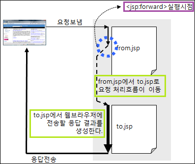
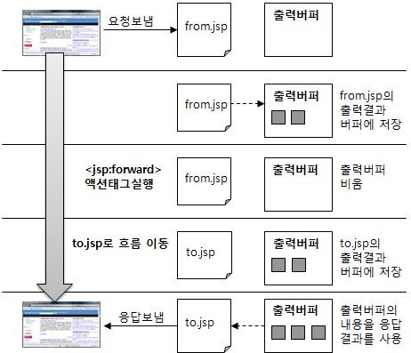

# <jsp:forward page="forward.jsp">

* request 유지
* url 노출 x
* 하위 태그는 실행 되지 않고 버퍼를 비운다.

<table>
    <th></th>
    <tr></tr>
    <tr></tr>
    <tr></tr>
</table>

|비교|include 액션|forward 액션|
|---|-------|-------|
|처리|해당 url에 코드가 삽입된다.|url는 유지한채  처리되는 내부 jsp파일이 바뀐다.|
|제어권|해당 url로 제어권이 돌아온다.|제어권이 forward page로 넘어간다.|
| 공통 <td colspan="3"> `<jsp:param name="name" value="value"> `로 인수를 넘길 수 있다. |
|ddddddddddddd

 

|비교|리다이렉트|forward 액션|
|-------|---------|-----------|
|요청 수| 2| 1|
|용도|서버의 데이터 변경시|분기에 따라 기능별로 모듈화 할수 있게 한다.|

> WEB_INF 폴더안의 jsp파일은   
> 사용자가 직접 접근이 불가능하다.
>  