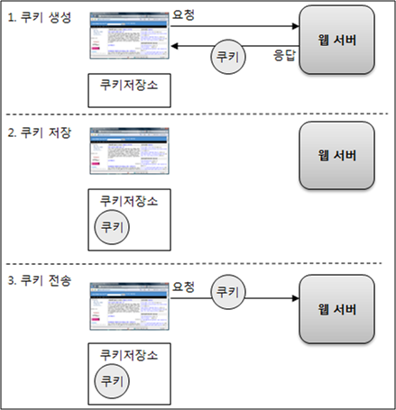
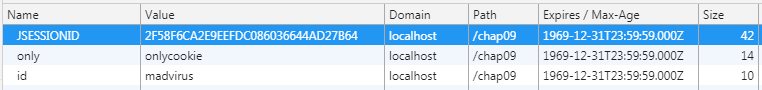
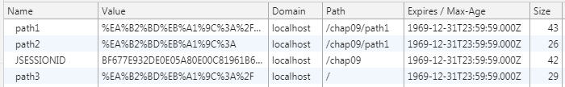
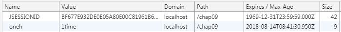

# 쿠키(Cookie)



1. 쿠키 생성 단계 
2. 쿠키 저장 단계(클라이언트측에 저장)
3. 쿠키 전송 단계(요청마다 저장된 쿠키를 같이 전송)

## 쿠키 생성하기

```jsp
<%
    Cookie cookie = new Cookie("key", URLEncoder.encode("value", "utf-8"));
    response.addCookie(cookie);
%>
```

<br>

## 저장된 쿠키 읽기

```jsp
<%
Cookie[] cookies = request.getCookies();
if (cookies != null && cookies.length > 0) {
	for (int i = 0 ; i < cookies.length ; i++) {
%>
        <%= cookies[i].getName() %> = 
        <%= URLDecoder.decode(cookies[i].getValue(), "utf-8") %><br>
<%
	}
} else {
%>
    쿠키가 존재하지 않습니다.
<%
	}
%>
```

<br>

## 쿠키 값 변경 

```jsp
<%
Cookie[] cookies = request.getCookies();
if (cookies != null && cookies.length > 0) {
    for (int i = 0 ; i < cookies.length ; i++) {
        if (cookies[i].getName().equals("name")) {
            Cookie cookie = new Cookie("name", URLEncoder.encode("JSP프로그래밍", "utf-8"));
            response.addCookie(cookie);
        }
    }
}
%>
```   
> 저장된 쿠키 값을 변경 시 setValue(String) 메소드를 사용하지 않고   
> 같은 키를 가진 새로운 쿠키를 생성해서 덮어쓰기 한다.  

<br>

## 쿠키 삭제하기
```jsp
<%
Cookie[] cookies = request.getCookies();
if (cookies != null && cookies.length > 0) {
    for (int i = 0 ; i < cookies.length ; i++) {
        if (cookies[i].getName().equals("name")) {
            Cookie cookie = new Cookie("name", "");
            cookie.setMaxAge(0);
            response.addCookie(cookie);
        }
    }
}
%>
```
>an integer specifying the maximum age of the cookie in seconds  
>if negative, means the cookie is not stored  
>if zero, deletes the cookie

<br>

## 쿠키의 도메인

* 저장된 쿠키를 보낼 때 해당 도메인에만 전송 
* `getDomain():String`   
* `setDomain(String pattern):void`


```jsp
<%
    Cookie cookie1 = new Cookie("id", "madvirus");
    cookie1.setDomain("localhost");
    response.addCookie(cookie1);

    Cookie cookie2 = new Cookie("only", "onlycookie");
    response.addCookie(cookie2);

    Cookie cookie3 = new Cookie("invalid", "invalidcookie");
    cookie3.setDomain("javacan.tistory.com");
    response.addCookie(cookie3);
%>
```

   

세번째 쿠키는 타 도메인이기 때문에 보안상 웹브라우저가 저장하지 않는다.

<br>

## 쿠키의 경로

* `getPath():String`   
* `setPath(String url):void`

/chap09/path1/setCookieWithPath.jsp
```jsp
<%
	Cookie cookie1 = new Cookie("path1", URLEncoder.encode("경로:/chap09/path1", "utf-8"));
	cookie1.setPath("/chap09/path1");
	response.addCookie(cookie1);
	
	Cookie cookie2 = new Cookie("path2", URLEncoder.encode("경로:", "utf-8"));
	response.addCookie(cookie2);
	
	Cookie cookie3 = new Cookie("path3", URLEncoder.encode("경로:/", "utf-8"));
	cookie3.setPath("/");
	response.addCookie(cookie3);

	Cookie cookie4 = new Cookie("path4", URLEncoder.encode("경로:/chap09/path2", "utf-8"));
	cookie4.setPath("/chap09/path2");
	response.addCookie(cookie4);
%>
```

   
현재 경로가 아닌 네번째 쿠키는 저장 되지 않는다.

<br>

## 쿠키의 유효시간

```jsp
<%
    Cookie cookie = new Cookie("oneh", "1time");
    cookie.setMaxAge(60 * 60); // 60초(1분) * 60 = 1시간
    response.addCookie(cookie);
%>
```

