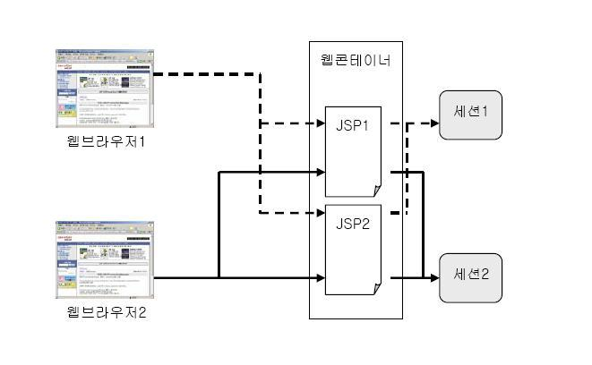

# session 기본 객체

`<%@ page session="true" %>`

<br>




|비교|cookie|session|
|---|---|---|
|저장장소|웹브라우저|서버|
|user가 조작|가능|불가능|
|공유|도메인을 통해 공유 가능|공유 불가능|
|기본 유효시간|세션이 종료될 때까지 유지|서버가 종료 될 때까지 유지|

<br>

## 세션 종료

```jsp
<%
    session.invalidata();
%>     
```
* 이후 다음 요청시 새로운 session이 생성된다.
* 현재 jsp파일에서 기존의 session의 id 속성외에 다른 속성 접근 불가
* 로그아웃 처리

<br>

## 세션 유효 시간 설정
`session.getLastAccessedTime()`

* web.xml
```xml
<session-config>
    <session-timeout>60</session-timeout>
</session-config>
```
<br>

* session 기본 객체 
```jsp
<%
    session.setMaxInactiveInterval(60*60);
%>
```
> 제거되지 않는 세션 객체로 인해 메모리가 부족해지는 현상을 방지할려면,   
> 반드시 세션 타임아웃 시간을 지정해주어야 한다.


<br>

## 세션 생성

||`request.getSession(true)`| `request.getSession(false)`|
|---|---|---|
|기존의 session 객체가 있으면| 기존의 session | 기존의 session|
|기존의 session 객체가 없으면| 새로운 session | null|
||reqeust.getSession()|pageContext.getSession()|

