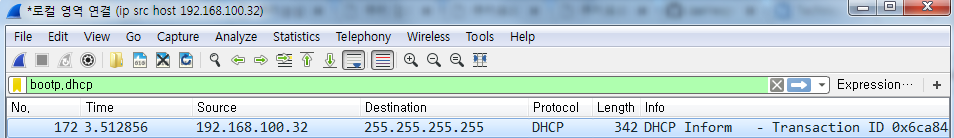

# DHCP(Dynamic Host Configurarion Protocol)


```dos
ipconfig /release
```


```dos
ipconfig /renew
```


* WireShark  
> filter : bootp.dhcp




```
Frame 172: 342 bytes on wire (2736 bits), 342 bytes captured (2736 bits) on interface 0
Ethernet II, Src: Giga-Byt_6c:90:cc (40:8d:5c:6c:90:cc), Dst: Broadcast (ff:ff:ff:ff:ff:ff)
Internet Protocol Version 4, Src: 192.168.100.32, Dst: 255.255.255.255
User Datagram Protocol, Src Port: 68, Dst Port: 67
Bootstrap Protocol (Inform)
    Message type: Boot Request (1)
    Hardware type: Ethernet (0x01)
    Hardware address length: 6
    Hops: 0
    Transaction ID: 0x6ca84a8c
    Seconds elapsed: 0
    Bootp flags: 0x8000, Broadcast flag (Broadcast)
    Client IP address: 192.168.100.32
    Your (client) IP address: 0.0.0.0
    Next server IP address: 0.0.0.0
    Relay agent IP address: 0.0.0.0
    Client MAC address: Giga-Byt_6c:90:cc (40:8d:5c:6c:90:cc)
    Client hardware address padding: 00000000000000000000
    Server host name not given
    Boot file name not given
    Magic cookie: DHCP
    Option: (53) DHCP Message Type (Inform)
    Option: (61) Client identifier
    Option: (12) Host Name
    Option: (60) Vendor class identifier
    Option: (55) Parameter Request List
    Option: (255) End
    Padding: 0000000000000000
```

