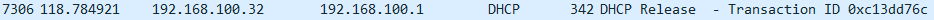
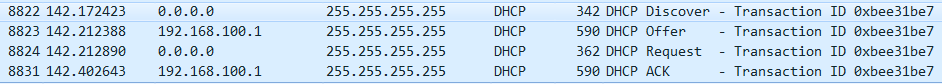

# DHCP(Dynamic Host Configurarion Protocol)

* WireShark  
> filter : bootp.dhcp

```dos
ipconfig /release
```



<br />

```dos
ipconfig /renew
```

* Discover -> Offer -> Request -> ACK

```
Frame 8822: 342 bytes on wire (2736 bits), 342 bytes captured (2736 bits) on interface 0
Ethernet II, Src: Giga-Byt_6c:90:cc (40:8d:5c:6c:90:cc), Dst: Broadcast (ff:ff:ff:ff:ff:ff)
Internet Protocol Version 4, Src: 0.0.0.0, Dst: 255.255.255.255
User Datagram Protocol, Src Port: 68, Dst Port: 67
Bootstrap Protocol (Discover)
    Message type: Boot Request (1)
    Hardware type: Ethernet (0x01)
    Hardware address length: 6
    Hops: 0
    Transaction ID: 0xbee31be7
    Seconds elapsed: 0
    Bootp flags: 0x8000, Broadcast flag (Broadcast)
    Client IP address: 0.0.0.0
    Your (client) IP address: 0.0.0.0
    Next server IP address: 0.0.0.0
    Relay agent IP address: 0.0.0.0
    Client MAC address: Giga-Byt_6c:90:cc (40:8d:5c:6c:90:cc)
    Client hardware address padding: 00000000000000000000
    Server host name not given
    Boot file name not given
    Magic cookie: DHCP
    Option: (53) DHCP Message Type (Discover)
    Option: (61) Client identifier
    Option: (50) Requested IP Address
        Length: 4
        Requested IP Address: 192.168.100.32
    Option: (12) Host Name
    Option: (60) Vendor class identifier
    Option: (55) Parameter Request List
    Option: (255) End
    Padding: 000000

```
1. Source MAC 주소를 PC로 하고 Destination MAC 주소를 FF:FF:FF:FF:FF:FF로 하여 이더넷 망에 `브로드캐스팅`한다.
2. Source IP 주소를 0.0.0.0으로 하고 Destination IP 주소를 255.255.255.255로 하여 IP 망에 `브로드캐스팅`한다.
3. DHCP Discover 메시지 내에 `Broadcast Flag=1`으로 설정하여 본 메시지의 응답인 DHCP Offer 메시지를 `브로드캐스트`로 수신하겠다고 DHCP서버에 요청한다. 반면에 `Broadcast Flag=0`이면 `유니캐스트`로 수신하겠다고 DHCP 서버에 요청한다.
4. 기존에 할당 받았던 `단말 주소(192.168.10.32)`를 단말(Windows 7 레지스트리)이 기억하고 있다가 IP 주소 할당 요청을 위해 DHCP Discover 메시지를 보낼 때, “난 192.168.100.32 주소를 받고 싶다”고 DHCP 서버에 알린다.

<br>

```
Frame 8823: 590 bytes on wire (4720 bits), 590 bytes captured (4720 bits) on interface 0
Ethernet II, Src: EfmNetwo_a8:18:48 (90:9f:33:a8:18:48), Dst: Broadcast (ff:ff:ff:ff:ff:ff)
Internet Protocol Version 4, Src: 192.168.100.1, Dst: 255.255.255.255
User Datagram Protocol, Src Port: 67, Dst Port: 68
Bootstrap Protocol (Offer)
    Message type: Boot Reply (2)
    Hardware type: Ethernet (0x01)
    Hardware address length: 6
    Hops: 0
    Transaction ID: 0xbee31be7
    Seconds elapsed: 0
    Bootp flags: 0x8000, Broadcast flag (Broadcast)
    Client IP address: 0.0.0.0
    Your (client) IP address: 192.168.100.32
    Next server IP address: 0.0.0.0
    Relay agent IP address: 0.0.0.0
    Client MAC address: Giga-Byt_6c:90:cc (40:8d:5c:6c:90:cc)
    Client hardware address padding: 00000000000000000000
    Server host name not given
    Boot file name not given
    Magic cookie: DHCP
    Option: (53) DHCP Message Type (Offer)
        Length: 1
        DHCP: Offer (2)
    Option: (54) DHCP Server Identifier
        Length: 4
        DHCP Server Identifier: 192.168.100.1
    Option: (51) IP Address Lease Time
    Option: (1) Subnet Mask
        Length: 4
        Subnet Mask: 255.255.255.0
    Option: (3) Router
        Length: 4
        Router: 192.168.100.1
    Option: (6) Domain Name Server
        Length: 8
        Domain Name Server: 203.248.252.2
        Domain Name Server: 164.124.101.2
    Option: (255) End
    Padding: 000000000000000000000000000000000000000000000000...
```
1. 자신의 아이피를 담아서 패킷을 브로드캐스팅한다.이때 패킷에 클라이언트의 `맥주소(40:8d:5c:6c:90:cc)`가 담겨있기 때문에 목적지 구분이 가능하다. 
2. 이때 ip, 서브넷 마스크, 임대시간, DNS서버등 여러가지 정보를 같이 보낸다.


<br>


```
Frame 8824: 362 bytes on wire (2896 bits), 362 bytes captured (2896 bits) on interface 0
Ethernet II, Src: Giga-Byt_6c:90:cc (40:8d:5c:6c:90:cc), Dst: Broadcast (ff:ff:ff:ff:ff:ff)
Internet Protocol Version 4, Src: 0.0.0.0, Dst: 255.255.255.255
User Datagram Protocol, Src Port: 68, Dst Port: 67
Bootstrap Protocol (Request)
    Message type: Boot Request (1)
    Hardware type: Ethernet (0x01)
    Hardware address length: 6
    Hops: 0
    Transaction ID: 0xbee31be7
    Seconds elapsed: 0
    Bootp flags: 0x8000, Broadcast flag (Broadcast)
        1... .... .... .... = Broadcast flag: Broadcast
        .000 0000 0000 0000 = Reserved flags: 0x0000
    Client IP address: 0.0.0.0
    Your (client) IP address: 0.0.0.0
    Next server IP address: 0.0.0.0
    Relay agent IP address: 0.0.0.0
    Client MAC address: Giga-Byt_6c:90:cc (40:8d:5c:6c:90:cc)
    Client hardware address padding: 00000000000000000000
    Server host name not given
    Boot file name not given
    Magic cookie: DHCP
    Option: (53) DHCP Message Type (Request)
    Option: (61) Client identifier
    Option: (50) Requested IP Address
        Length: 4
        Requested IP Address: 192.168.100.32
    Option: (54) DHCP Server Identifier
        Length: 4
        DHCP Server Identifier: 192.168.100.1
    Option: (12) Host Name
    Option: (81) Client Fully Qualified Domain Name
    Option: (60) Vendor class identifier
    Option: (55) Parameter Request List
    Option: (255) End

```
1. Offer를 받은 클라이언트는 해당 ip와 같이 다시 DHCP서버로 `브로드캐스팅`한다.(자신의 ip가 아직 없기 때문에)
2. 브로드캐스팅으로 수신하겠다고 DHCP서버에 요청한다.`(Broadcast Flag=1)`
3. 이때 DHCP서버의 ip를 같이 보내 DHCP서버 사이 구분이 가능하다.


<br>

```
Frame 8831: 590 bytes on wire (4720 bits), 590 bytes captured (4720 bits) on interface 0
Ethernet II, Src: EfmNetwo_a8:18:48 (90:9f:33:a8:18:48), Dst: Broadcast (ff:ff:ff:ff:ff:ff)
Internet Protocol Version 4, Src: 192.168.100.1, Dst: 255.255.255.255
User Datagram Protocol, Src Port: 67, Dst Port: 68
Bootstrap Protocol (ACK)
    Message type: Boot Reply (2)
    Hardware type: Ethernet (0x01)
    Hardware address length: 6
    Hops: 0
    Transaction ID: 0xbee31be7
    Seconds elapsed: 0
    Bootp flags: 0x8000, Broadcast flag (Broadcast)
    Client IP address: 0.0.0.0
    Your (client) IP address: 192.168.100.32
    Next server IP address: 0.0.0.0
    Relay agent IP address: 0.0.0.0
    Client MAC address: Giga-Byt_6c:90:cc (40:8d:5c:6c:90:cc)
    Client hardware address padding: 00000000000000000000
    Server host name not given
    Boot file name not given
    Magic cookie: DHCP
    Option: (53) DHCP Message Type (ACK)
    Option: (54) DHCP Server Identifier
    Option: (51) IP Address Lease Time
    Option: (1) Subnet Mask
    Option: (3) Router
    Option: (6) Domain Name Server
    Option: (255) End
    Padding: 000000000000000000000000000000000000000000000000...
```
1. DHCP 서버는 DHCP Request 메시지의 `Broadcast Flag값(1)`을 그대로 DHCP Ack 메시지의 Broadcast Flag에 복사하여 전달한다.
