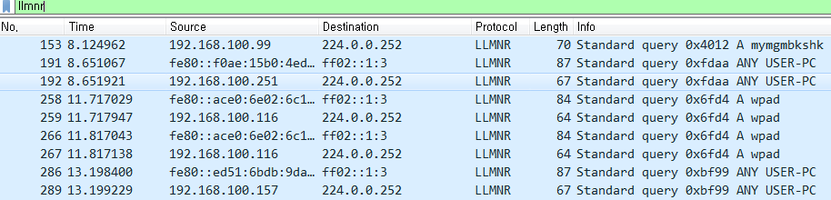

# LLMNR(Link Local Multicast Name Resolution)

로컬 링크상에서 호스트의 이름을 조회하는데 이용되는 프로토콜이다.

윈도 비스타, 윈도 서버 2008, 윈도 7, 윈도 8에 포함되어 있다.

이전에 네크워크 상 주변에 있는 컴퓨터 이름을 조회하기 위해서 NetBIOS를 이용을 했다. 
그런데, NetBIOS가 IPv4 환경에서만 작동하기 때문에 양 환경에서 모두 이용될 수 있는 LLMNR프로토콜이 요구되었다.


## LLMNR 중지하기

- `Window7`   
 제어판 > 네트워크 및 공유센터 > 고급공유 설정 > 네크워크 검색 끄기

<br>



> Filter : llmnr

```
Frame 1: 66 bytes on wire (528 bits), 66 bytes captured (528 bits) on interface 0
Ethernet II, Src: Giga-Byt_6c:90:cc (40:8d:5c:6c:90:cc), Dst: IPv4mcast_fc (01:00:5e:00:00:fc)
Internet Protocol Version 4, Src: 192.168.100.32, Dst: 224.0.0.252
User Datagram Protocol, Src Port: 63550, Dst Port: 5355
Link-local Multicast Name Resolution (query)
```

* IPv4 - 224.0.0.252 , MAC - 01-00-5E-00-00-FC
 
* IPv6 - FF02:0:0:0:0:0:1:3

* UDP 5355 Port